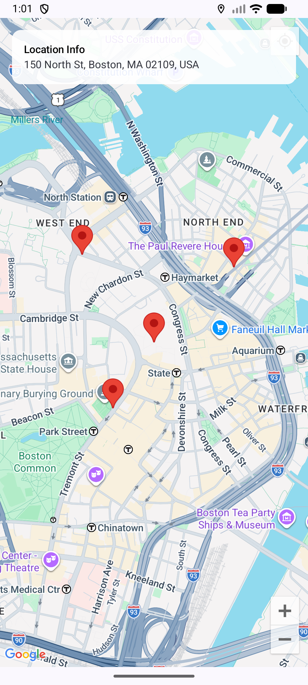

# CS501_Individual Assignment 4
# Q2 - Location Information

## Description

This project is an Android app built using Kotlin and Jetpack Compose that works with Google Maps and location services. The app requests location permission, displays a Google Map, shows marker locations, displays address information, and allows the user to place custom markers by tapping on the map.

## Features

- Requests location permission from the user
- Displays Google Map in the app
- Centers the map on the default Boston location
- Adds a marker for the default location
- Adds the user’s location marker when permission is granted
- Displays address information using Geocoder
- Allows user to place custom markers by tapping on the map
- Updates displayed address when a new marker is placed

## Technologies Used

- Kotlin
- Jetpack Compose
- Google Maps Compose
- Fused Location Provider
- Geocoder
- Android Location Permission APIs

## How the App Works

The app first checks whether location permission is granted. A Google Map is displayed with an initial marker placed at Boston city center. If the user grants permission, the app tries to get the current device location and adds it as another marker.

An information card is shown at the top of the screen. It displays address details for the selected location. When the user taps anywhere on the map, a new marker is added at that point, and the address information is updated for that selected location.

## Implementation Details

### 1. Location Permission
The app uses `ActivityResultContracts.RequestPermission()` to request `ACCESS_FINE_LOCATION` permission at runtime.

### 2. Google Map Display
The app uses `GoogleMap` from Maps Compose to display the map interface.

### 3. Marker Placement
A default marker is placed at Boston. Additional markers are added for:
- the user’s current location
- custom locations selected by tapping on the map

### 4. Address Information
The `Geocoder` API is used to convert latitude and longitude coordinates into a readable address.

### 5. User Interaction
The `onMapClick` listener is used to let the user place custom markers interactively on the map.

## Assignment Requirements Covered

- Request location permission
- Display Google Maps
- Add marker at user location
- Display address information
- Allow custom markers on map tap

## Screenshot

## How to Run

1. Open the project in Android Studio  
2. Add a valid Google Maps API key in `AndroidManifest.xml`  
3. Run the app on an emulator or Android device  
4. Grant location permission when prompted  
5. Tap on the map to place custom markers and view address information  

## AI Usage Note

ChatGPT was used as a supporting tool for guidance, understanding concepts, structuring the solution, and fixing minor code errors. The overall implementation, logic, and final code were written and developed by me.

## Conclusion

This project demonstrates how to use location services and Google Maps in an Android application. It includes permission handling, map interaction, and address retrieval using Geocoder. The app also allows user interaction by placing markers dynamically, which helps in understanding real-time map-based features in Android development.
